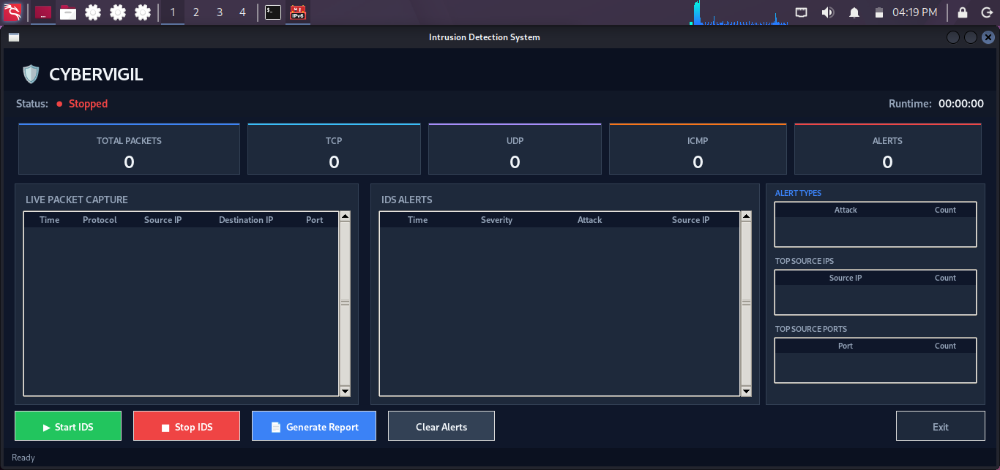

# 🛡️ CyberVigil - Signature-Based Network Intrusion Detection System

CyberVigil is a lightweight Signature-Based Network Intrusion Detection System (IDS) developed in Python using Scapy and Tkinter. It monitors live network traffic, detects predefined attack signatures, logs intrusion events, and provides a modern graphical dashboard for real-time monitoring.

---
# Dashboard



## Features

- Real-time packet capture
- Signature-based attack detection
- Modern Tkinter dashboard
- Live packet monitoring
- Intrusion alerts
- Packet statistics
- Threat intelligence panel
- Alert logging
- Report generation
- Modular project structure

---

## Attack Detection Rules

CyberVigil currently detects:

- SYN Flood
- ICMP Flood
- Port Scanning
- High Traffic
- Suspicious Port Access

---

## Technologies Used

- Python 3.x
- Scapy
- Tkinter
- Threading
- Collections
- Datetime

---

## Installation

Clone the repository

```bash
git clone https://github.com/ChromaticStars/CyberVigil.git
```

Navigate to the project folder

```bash
cd CyberVigil
cd IDS Project Files
```

(Optional) Create a virtual environment

```bash
python3 -m venv venv
source venv/bin/activate
```

Install the required dependencies

```bash
pip3 install -r requirements.txt
```

---

## Running the Project

Run the IDS with root privileges (required for packet capture using Scapy):

```bash
sudo python3 main.py
```

If you're using a virtual environment:

```bash
sudo ./venv/bin/python main.py
```

## Dashboard

The dashboard provides:

- System Status
- Runtime Counter
- Packet Statistics
- Live Packet Capture
- IDS Alerts
- Threat Intelligence
- Start/Stop IDS
- Generate Report
- Clear Alerts

---

## Generated Report

The generated report contains:

- Runtime
- Packet Statistics
- Alert Summary
- Top Source IPs
- Top Destination Ports

---

## Future Improvements

- Machine Learning-based anomaly detection
- Deep Packet Inspection
- Email alert notifications
- Database integration
- Packet filtering
- Export reports to PDF
- Multi-interface monitoring

---
## Tested On

- Kali Linux
- Developed by – Ahana Sharma
- Industrial Training Project – Network Intrusion Detection System

---

## License

This project is intended for educational and learning purposes.
